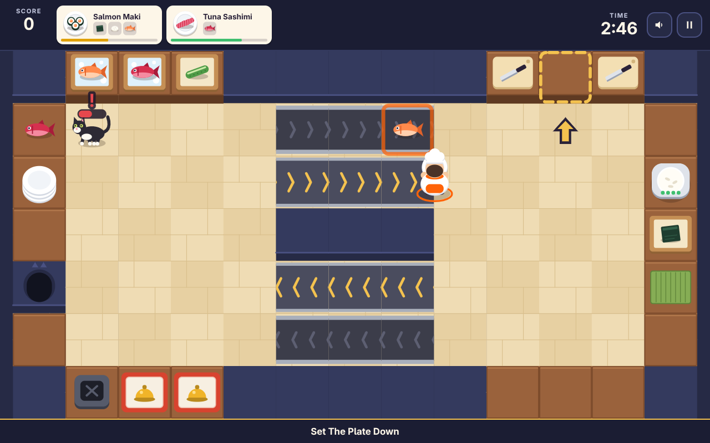
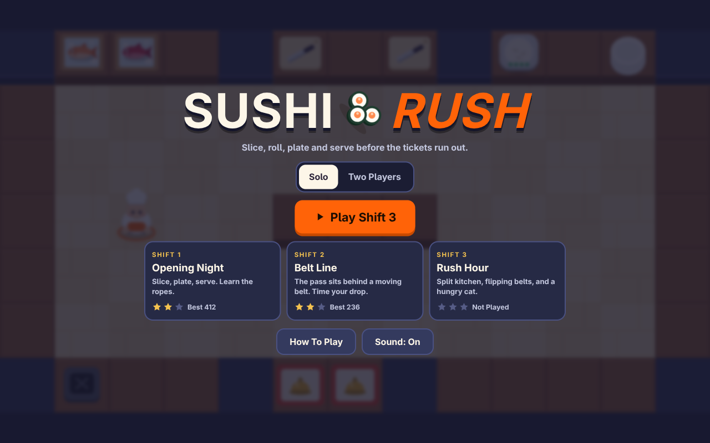
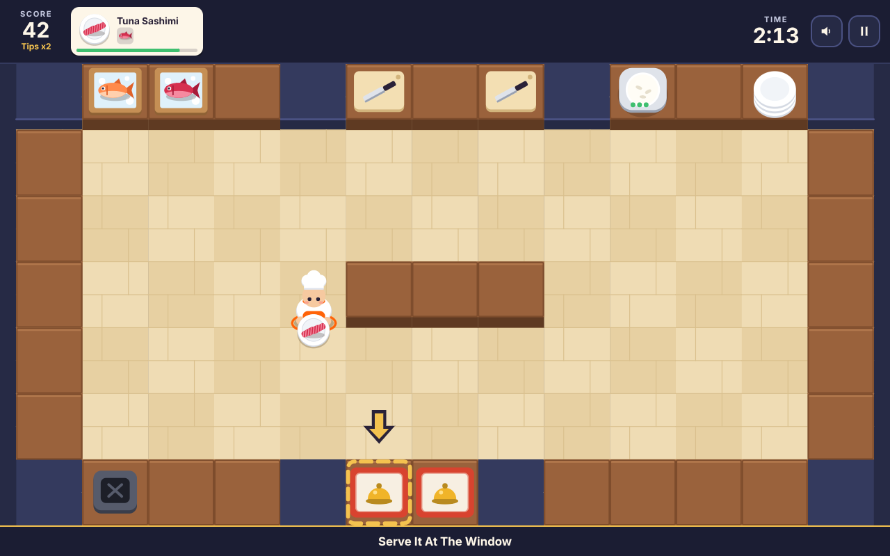
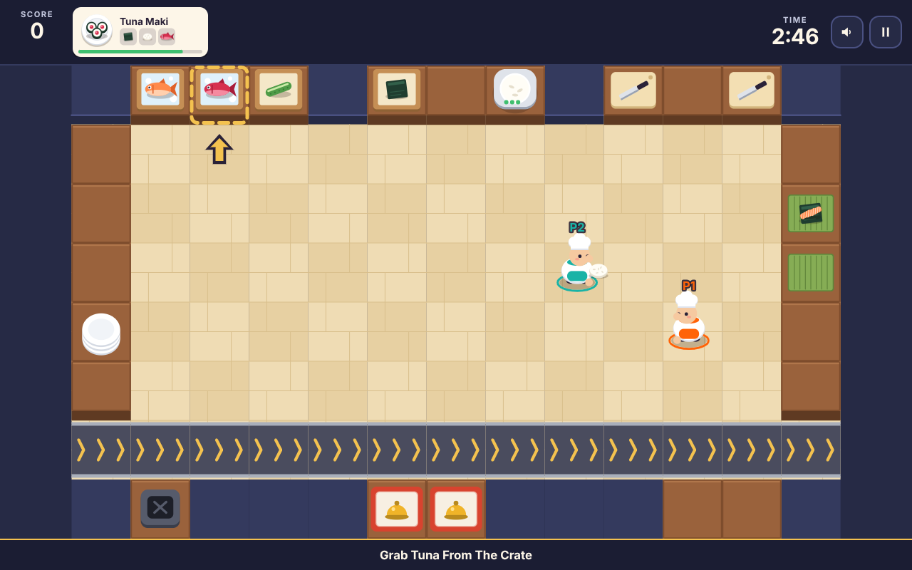
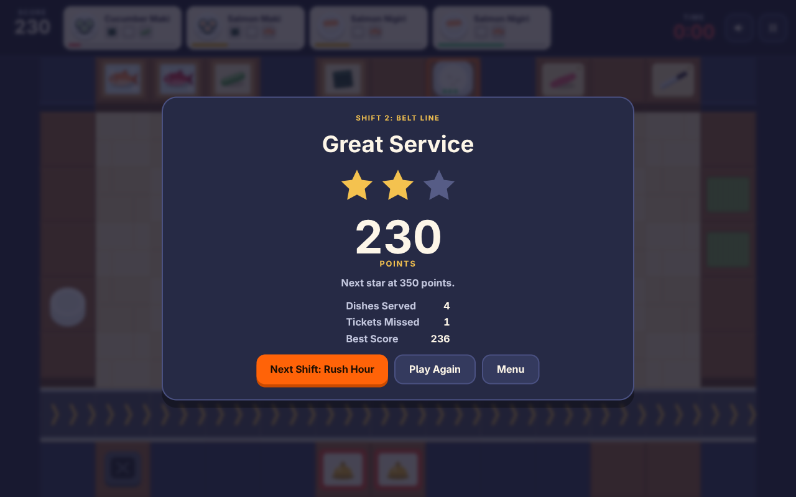
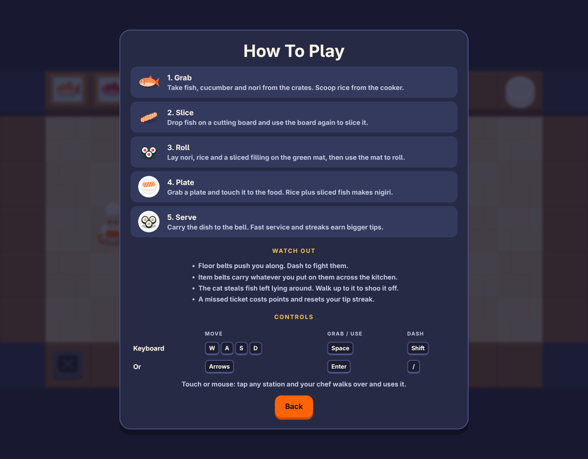
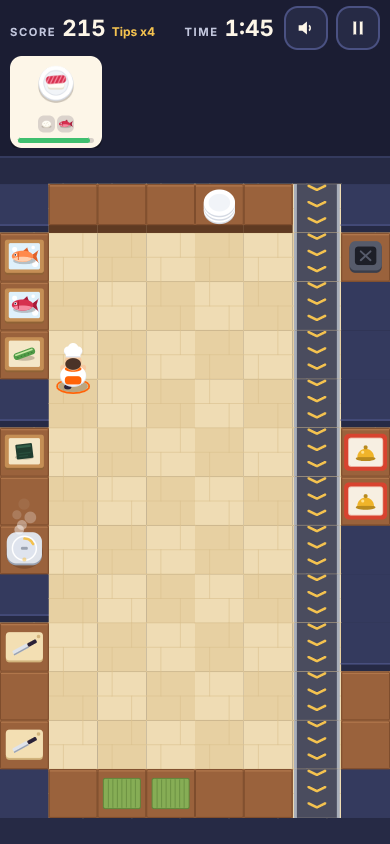

<div align="center">
  
  <h1 align="center" style="border-bottom: none; margin-bottom: 0;">Sushi Rush</h1>
  <h3 align="center" style="margin-top: 0; font-weight: normal;">
    a frantic sushi bar kitchen game in typescript and canvas, for one or two chefs
  </h3>
</div>

<br />

## 🍣 The Pitch

Tickets pile up. Fish needs slicing. The rice cooker is empty again. And the cat is back.

Sushi Rush is a fast kitchen game you can play in any browser. Grab fish and rice, slice, roll, plate and serve before each ticket runs out. Play solo, or share one keyboard with a friend and split the work.

- **Three shifts**, each with a new kitchen and a new problem
- **Eight dishes**, from quick sashimi to a three part omakase set
- **Hazards**: floor belts that push you, item belts that carry food, belts that flip direction, and a cat that steals fish
- **No install, no login, no network**: it loads in a blink and runs offline

<br />

## 🚀 Quick Start

```bash
git clone https://github.com/stevederico/sushi-rush.git
cd sushi-rush
npm install
npm run dev
```

Open **http://localhost:5173** and press **Play**.

<br />

## 🎮 Controls

One button does everything: grab, drop, combine, slice, roll and serve. It picks the right action for the station in front of you.

| Who | Move | Grab / Use | Dash |
|---|---|---|---|
| **Solo** | `W` `A` `S` `D` or arrows | `Space`, `E` or `Enter` | `Shift`, `Q` or `/` |
| **Player 1** | `W` `A` `S` `D` | `E` or `Space` | `Q` or left `Shift` |
| **Player 2** | Arrows | `Enter` or `.` | `/` or right `Shift` |
| **Touch / Mouse** | Tap a station or a floor tile | Happens on arrival | |

`Esc` or `P` pauses. On an upright phone the kitchen turns on its side to fill the screen, and turns back if you rotate mid-shift. Two Players appears once a keyboard is detected.

<br />

## 🍱 How A Dish Comes Together

1. **Grab** fish, cucumber or nori from a crate. Scoop rice from the cooker.
2. **Slice** fish or cucumber on a cutting board.
3. **Roll** nori, rice and a sliced filling on the green mat.
4. **Plate** it. Rice plus sliced fish makes nigiri. Sliced fish alone is sashimi.
5. **Serve** at the bell. Fast service and unbroken streaks earn bigger tips.

| Dish | On The Plate | Points |
|---|---|---|
| **Sashimi** (salmon, tuna) | Sliced fish | 20 |
| **Nigiri** (salmon, tuna) | Rice and sliced fish | 35 |
| **Maki** (salmon, tuna, cucumber) | A roll | 50 |
| **Omakase Set** | Salmon roll, rice and sliced tuna | 90 |

<br />

## 📸 Screenshots

| Title | First Shift |
|---|---|
|  |  |

| Two Players | Results |
|---|---|
|  |  |

| How To Play | Phone |
|---|---|
|  |  |

<br />

## 🧰 What's Included

### 🔪 **Kitchen**

- **Three shifts**: Opening Night, Belt Line and Rush Hour
- **Nine station types**: crates, cutting boards, rolling mats, rice cooker, plates, counters, item belts, trash and the serving window
- **Coach hints** that point at the next station while you learn
- **Stars and best scores** saved in the browser, for solo and two player runs

### 🎨 **Look And Sound**

- **Every sprite is drawn in code** on a canvas: chefs, fish, plates, the cat
- **Every sound is made in code** with WebAudio, including the music loop
- **Reduced motion** is honoured: particles and screen flashes switch off

### 🧪 **Developer Experience**

- **366 unit tests** on the game logic, including solo and two-chef bots that play every shift
- **Pure simulation**: the kitchen runs without a browser, so tests are fast
- **Tiny build**: about 24 kB of JavaScript after gzip, no runtime dependencies

<br />

## 🛠️ Tech Stack

| Technology | Version | Purpose |
|---|---|---|
| **TypeScript** | 7.0 | Language, strict mode |
| **Vite** | 8.3 | Dev server and static build |
| **Vitest** | 5.0 | Unit tests |
| **Canvas 2D** | | Rendering |
| **WebAudio** | | Sound and music |

<br />

## 🏗️ Architecture

The game is split in two. `src/game` holds the kitchen rules as plain data and functions with no browser code. Everything else draws that state or feeds input into it.

```ts
const world = createWorld(getLevel(1), 1, seed);
updateWorld(world, [input], 1 / 60);
for (const event of drainEvents(world)) playSound(event);
render(ctx, { world, effects, time, width, height, hint });
```

| Folder | Holds |
|---|---|
| `src/game` | Items, recipes, levels, movement, stations, orders, belts, the cat, the planner |
| `src/render` | Canvas art and effects |
| `src/audio` | Sound effects and music |
| `src/input` | Keyboard and pointer |
| `src/ui` | Menus, HUD and tickets |
| `src/app` | Screen flow and the frame loop |

<br />

## 📦 Scripts

```bash
npm run dev        # dev server with hot reload
npm run build      # type check, then build static files into dist/
npm run preview    # serve the build locally
npm test           # run the unit tests
```

`dist/` is plain static files with relative paths. Host it anywhere that serves files.

Set `VITE_SITE_URL` at build time to make the link preview image a full URL, which X, iMessage and Slack need. Optional page view tracking loads only when `VITE_ANALYTICS_SRC` and `VITE_ANALYTICS_ID` are set. See `.env.example`.

<br />

## 📄 License

MIT License. See [LICENSE](LICENSE).

<br />

<div align="center">
  <p>Built with TypeScript, Vite and a lot of rice.</p>
</div>
